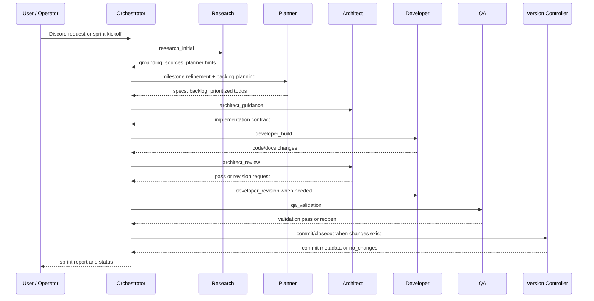

# `teams_runtime`

## Documentation Index

- [Quickstart](./docs/quickstart.md)
- [Configuration Guide](./docs/configuration_guide.md)
- [Operations Guide](./docs/operations_guide.md)
- [Implementation Notes](./docs/implementation.md)
- [Architecture](./docs/architecture.md)
- [Specification](./docs/specification.md)

## Concept

`teams_runtime` turns Discord into a coordinated agent workspace for getting project work from "someone asked for this" to backlog, sprint execution, validation, and closeout. Its objective is to make multi-agent work operational: requests are captured, plans are grounded, implementation is reviewed, QA has a clear gate, and completed work leaves behind usable reports instead of scattered chat fragments.

Think of it as a compact production crew for software projects. Instead of relying on one freeform agent conversation, you run a small team with explicit responsibilities, durable workspace state, and predictable handoffs.

## What You Can Achieve

- Turn Discord DMs and mentions into planner-owned backlog, specs, and sprint todos.
- Start research-grounded sprints from a milestone, brief, and requirements.
- Coordinate specialist agents through a governed flow from planning to build to review to QA.
- Keep operators informed with relay summaries, sprint status, and human-readable workspace artifacts.
- Close out completed work with git-backed commit reporting, sprint history, and reusable documentation.

## Roles At A Glance

- `orchestrator`: receives requests, owns routing, sprint state, and final reporting.
- `research`: runs the pre-planning research pass and gives planner grounding.
- `planner`: turns requests and research into backlog, specs, priorities, and sprint todos.
- `designer`: advises on UX, interaction flow, and user-facing message clarity.
- `architect`: gives implementation guidance and reviews developer output.
- `developer`: implements and revises sprint work.
- `qa`: validates behavior, regressions, and readiness.
- Internal agents: `parser`, `sourcer`, and `version_controller` support intent parsing, goal-based milestone sourcing, and git closeout.

## Standard Workflow



A user request becomes planner-owned backlog, sprint kickoff starts with research, implementation goes through architect guidance, developer work, and QA validation, and closeout records git and report artifacts.

## Integration Tools

Required:

- **Discord**: configure role bot tokens, role bot IDs, and `relay_channel_id`; `startup_channel_id` and `report_channel_id` are optional convenience channels.
- **Role runtime CLI**: the default role models run through the `codex` command; role models whose name includes `gemini` run through the `gemini` command instead. Install the CLI for the models you configure and keep it on `PATH`.
- **git**: sprint closeout, task commit checks, and commit reporting depend on git being available.

Optional:

- **GitHub CLI `gh`**: enables best-effort sprint issue publishing. Authenticate with `gh auth login`, or set `GH_TOKEN` / `GITHUB_TOKEN`.
- **Deep research backend**: Gemini, NotebookLM, Drive-style file keywords, and browser profile settings are used only when external research is configured.

The Discord client loads the nearest `.env` automatically, so local tokens may be exported in the shell or stored in a workspace-adjacent `.env`.

## Installation

With Python 3.10+:

```bash
pip install -r requirements.txt
```

## Quick Start

### 1. Scaffold a workspace

```bash
python -m teams_runtime init
```

Workspace resolution uses the current directory if it already contains both config files, then `./teams_generated`, then `./workspace/teams_generated`.

Use `--reset` only when you intentionally want to rebuild generated runtime content; it preserves `discord_agents_config.yaml` and archived sprint history.

```bash
python -m teams_runtime init --reset
```

### 2. Configure Discord

Edit `<workspace-root>/discord_agents_config.yaml` and replace every placeholder snowflake before starting listeners.

```yaml
relay_channel_id: "123456789012345678"
startup_channel_id: "123456789012345679"
report_channel_id: "123456789012345680"

agents:
  orchestrator: {name: orchestrator, role: orchestrator, description: Request routing, token_env: AGENT_DISCORD_TOKEN_ORCHESTRATOR, bot_id: "123456789012345681"}
  research: {name: research, role: research, description: Pre-planning research, token_env: AGENT_DISCORD_TOKEN_RESEARCH, bot_id: "123456789012345682"}
  planner: {name: planner, role: planner, description: Planning and PRD, token_env: AGENT_DISCORD_TOKEN_PLANNER, bot_id: "123456789012345683"}
  designer: {name: designer, role: designer, description: UX and response style, token_env: AGENT_DISCORD_TOKEN_DESIGNER, bot_id: "123456789012345684"}
  architect: {name: architect, role: architect, description: Architecture and review, token_env: AGENT_DISCORD_TOKEN_ARCHITECT, bot_id: "123456789012345685"}
  developer: {name: developer, role: developer, description: Implementation, token_env: AGENT_DISCORD_TOKEN_DEVELOPER, bot_id: "123456789012345686"}
  qa: {name: qa, role: qa, description: Quality assurance, token_env: AGENT_DISCORD_TOKEN_QA, bot_id: "123456789012345687"}

internal_agents:
  sourcer: {name: CS_ADMIN, role: sourcer, description: Internal goal sourcing presence agent, token_env: AGENT_DISCORD_TOKEN_CS_ADMIN, bot_id: "123456789012345688"}
```

`relay_channel_id` is required. `startup_channel_id` defaults to the relay channel when omitted, and `report_channel_id` defaults to the startup channel.

### 3. Configure runtime policy

Edit `<workspace-root>/team_runtime.yaml`. The only required runtime field is `sprint.id`.

```yaml
sprint:
  id: "2026-Sprint-03"
  interval_minutes: 180
  timezone: "Asia/Seoul"
  mode: "hybrid"
  start_mode: "auto"
  cutoff_time: "22:00"
  overlap_policy: "no_overlap"
  ingress_mode: "backlog_first"
  discovery_scope: "broad_scan"
  discovery_actions: []

ingress:
  dm: true
  mentions: true

allowed_guild_ids: []

role_defaults:
  research: {model: "gpt-5.5", reasoning: "xhigh"}
  planner: {model: "gpt-5.5", reasoning: "xhigh"}
  architect: {model: "gpt-5.5", reasoning: "xhigh"}
  developer: {model: "gpt-5.5", reasoning: "high"}

research_defaults: {app: "", notebook: "", files: [], mode: "", profile_path: "", completion_timeout: 600, callback_timeout: 1200, cleanup: false, reasoning_level: "Standard"}

actions: {}
```

`actions: {}` is valid. In that mode, orchestration and sprint planning still work, but user `execute` requests remain disabled.

You can update role defaults through the CLI:

```bash
python -m teams_runtime config role set --agent developer --model gpt-5.5 --reasoning high
python -m teams_runtime config role set --agent planner --model gemini-3.1-pro-preview
python -m teams_runtime config research set --app "Gemini Research App" --file "market.md" --reasoning-level Standard
```

Gemini role models ignore Codex reasoning levels at runtime, so status output reports their reasoning as `None`.

### 4. Export bot tokens

```bash
export AGENT_DISCORD_TOKEN_ORCHESTRATOR=...
export AGENT_DISCORD_TOKEN_RESEARCH=...
export AGENT_DISCORD_TOKEN_PLANNER=...
export AGENT_DISCORD_TOKEN_DESIGNER=...
export AGENT_DISCORD_TOKEN_ARCHITECT=...
export AGENT_DISCORD_TOKEN_DEVELOPER=...
export AGENT_DISCORD_TOKEN_QA=...
export AGENT_DISCORD_TOKEN_CS_ADMIN=...
```

### 5. Start the runtime

```bash
python -m teams_runtime start
python -m teams_runtime status
python -m teams_runtime list
```

The default relay transport is `internal`, which keeps role-to-role handoff payloads inside runtime state and posts compact monitoring summaries to Discord. Use Discord relay envelopes only when debugging relay traffic:

```bash
python -m teams_runtime start --relay-transport discord
python -m teams_runtime run --relay-transport discord
```

### 6. Start or control a sprint

```bash
python -m teams_runtime sprint start --milestone "Login workflow cleanup"
python -m teams_runtime sprint start --milestone "Login workflow cleanup" --brief "Preserve current relay flow" --requirement "Keep kickoff docs as source of truth"
python -m teams_runtime sprint status
python -m teams_runtime sprint stop
python -m teams_runtime sprint restart
```

Manual and scheduled sprint kickoff both begin with `research` before planner milestone refinement.

### 7. Start or control a goal

```bash
python -m teams_runtime goal start --objective "Deliver the reporting workflow" --stop-condition "Final report is archived and posted to the report channel"
python -m teams_runtime goal status
python -m teams_runtime goal stop
python -m teams_runtime goal resume
python -m teams_runtime goal cancel
```

Goal-driven sourcing is the internal sourcer's active role. If `--stop-condition` is omitted, the sourcer derives and persists one before it sources work. On an idle scheduler pass, the sourcer reads the active goal, linked sprint history, and bounded Markdown context from `shared_workspace/` excluding attachments. It then either marks the goal complete or proposes one sprint-ready milestone with a title, summary, kickoff requirements, and a sprint completion condition. That completion condition is normalized into the sprint kickoff requirements so research and planner see it as part of the sprint contract.

Only one goal can be active or resumable at a time. `goal stop` pauses goal sourcing and asks any linked active sprint to wrap up; `goal resume` reactivates a paused goal. `goal cancel` and `goal terminate` permanently cancel the goal, clear the active pointer, request wrap-up for any linked active sprint, and archive a cancellation report. Completed and cancelled goals archive a final report under `shared_workspace/goals/<goal_id>/` and publish it to `report_channel_id`.

### 8. Send a request

DM or mention the `orchestrator` bot:

```text
intent: plan
scope: Draft the login workflow and define backlog items
```

Messaging another public role still routes through the orchestrator so request ownership, backlog state, and requester replies stay consistent.

## Workspace Overview

Generated workspaces contain `discord_agents_config.yaml`, `team_runtime.yaml`, role folders, internal agent folders, and `shared_workspace/`. Runtime machine state lives under `.teams_runtime/`, while human-readable planning and sprint artifacts live under `shared_workspace/`.

Package docs stay under [`docs/`](./docs/README.md) and are not copied into generated workspaces.

## Development

`teams_runtime` uses Python's standard-library `unittest` runner for package-local tests. Do not use `pytest` as the `teams_runtime` test execution tool.

From the package directory, run the test suite with:

```bash
python -m unittest discover -s tests
```

From the parent repository directory, use:

```bash
python -m unittest discover -s teams_runtime/tests
```
