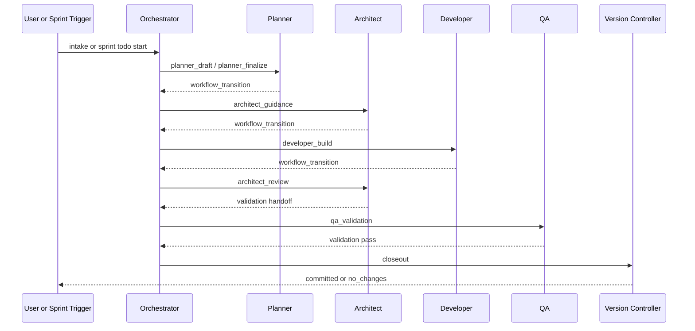
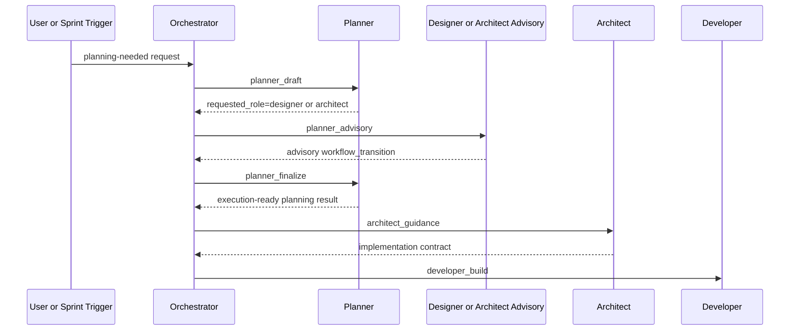
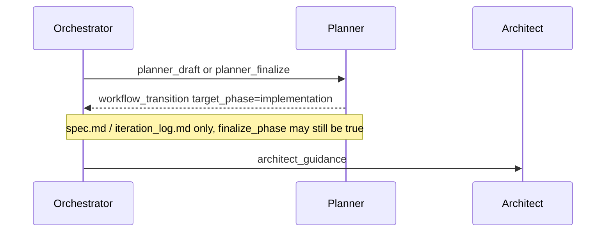
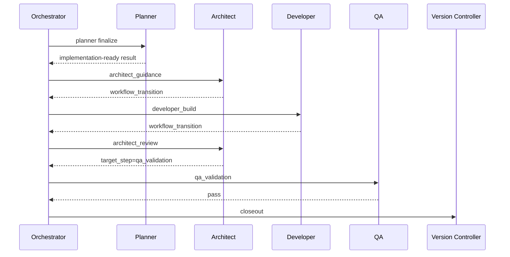
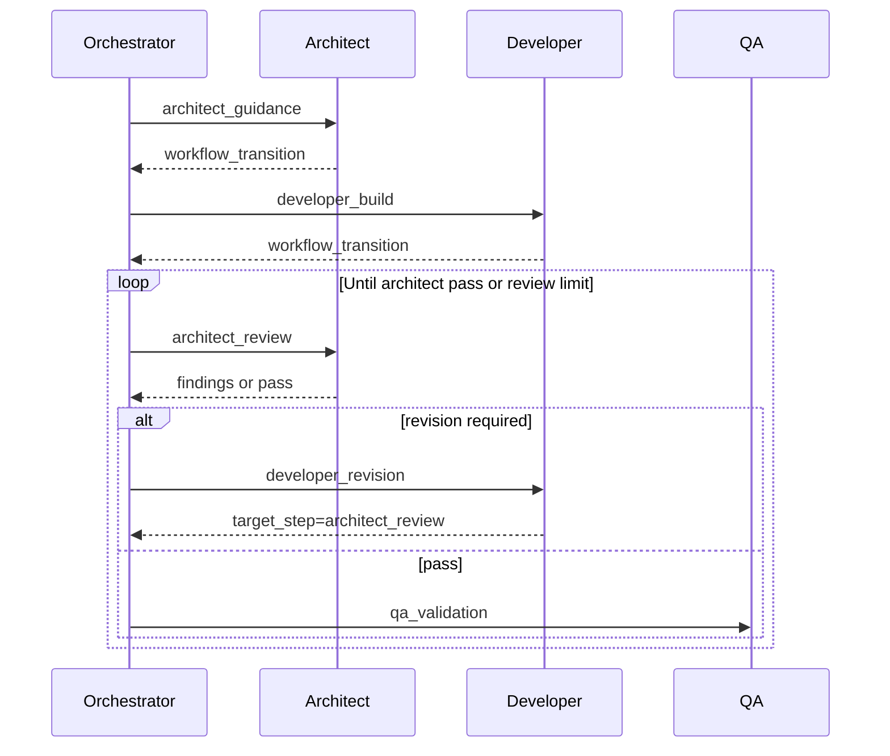
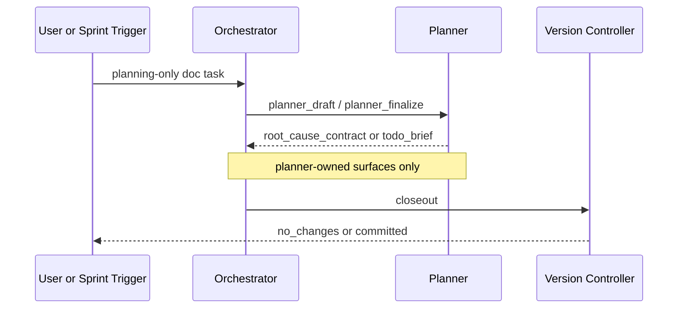
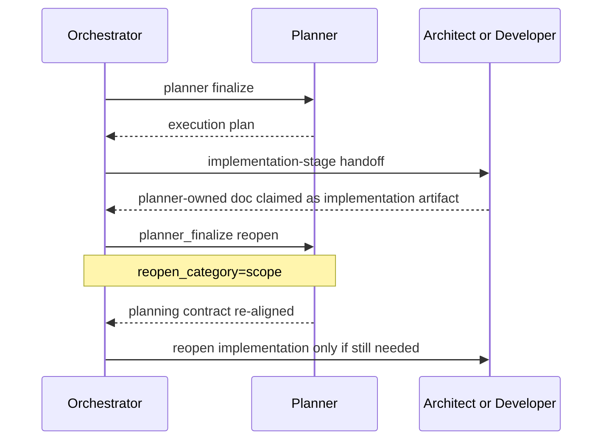

# `teams_runtime` Architecture

## Topology

```text
User / Operator
      |
      v
Discord DM / Mention
      |
      v
+----------------------+
| Orchestrator         |
| intake               |
| internal parser      |
| backlog              |
| scheduler            |
| sprint execution     |
| reply routing        |
+----+------------+----+
     |            |
     |            v
     |      +----------------------+
     |      | Runtime State        |
     |      | .teams_runtime/      |
     |      | backlog/             |
     |      | sprints/             |
     |      | requests/            |
     |      | internal_relay/      |
     |      +----------------------+
     |
     v
+----------------------+
| Internal Relay Bus   |
| orchestrator <-> role|
+----+----+----+----+--+
     |    |    |    |
     v    v    v    v
 planner designer architect developer qa
     |    |    |    |        |
     +----+----+----+--------+
                |
                v
      +----------------------+
      | Runtime Session      |
      | <runtime_identity>/  |
      | sessions/<id>        |
      | + ./workspace link   |
      +----------------------+
                |
                v
      +----------------------+
      | Project Workspace    |
      | contains teams_generated
      | and real code/docs   |
      +----------------------+
                |
                v
      +----------------------+
      | Discord Relay Channel|
      | relay summaries      |
      | + debug relay mode   |
      +----------------------+
```

## Core Model

`teams_runtime` has two distinct work layers:

- backlog layer
  - collects user requests and discovery findings
- sprint execution layer
  - turns selected backlog items into executable internal requests

This means not every user message immediately becomes a new `request_id`.

Identity model:

- `backlog_id`
  - one deferred work candidate
- `request_id`
  - one runtime request record
  - may identify either an intake/planner request or a sprint-internal execution request
- `runtime_identity`
  - one persisted session family
  - distinguishes service runtimes from local helper runtimes even when they target the same logical role
- `sprint_id`
  - one concrete sprint instance
- `sprint.id`
  - configured session-scope id from config

Runtime identity examples:

- public service runtime
  - `planner`
- orchestrator-local helper runtime
  - `orchestrator.local.planner`
- internal helper runtime service
  - `parser`

Current shared contract boundary:

- `teams_runtime/shared/models.py`
  - canonical home for shared runtime dataclasses and typed request/backlog/sprint/workflow/result contracts
- `teams_runtime/models.py`
  - compatibility re-export kept for migration stability
- `teams_runtime/workflows/orchestration/engine.py`
  - canonical pure workflow constants, normalization, state-transition helpers, routing-policy decisions, planner/QA workflow report guardrails, and planner-owned artifact policy helpers
- `teams_runtime/workflows/roles/__init__.py`
  - canonical role prompt registry plus agent utilization capability metadata consumed by orchestration scoring
- `teams_runtime/workflows/orchestration/relay.py`
  - canonical relay-send status mutation, relay failure-payload shaping, internal relay path/enqueue/archive, inbox scanning/loading, envelope round-trip helpers, synthetic relay-message stubs, pure internal relay action resolution, relay-summary fragment wrapping, section grouping, and section-message rendering
- `teams_runtime/workflows/orchestration/notifications.py`
  - canonical startup report rendering, boxed-report excerpt summarization, sourcer report client selection, sourcer activity report rendering, sourcer report state/failure-log policy, low-level Discord chunking, runtime signature tagging, cross-process send locking, startup fallback recovery, requester-status message formatting, requester reply delivery, immediate receipts, sprint completion user-summary delivery, sprint progress report delivery, internal relay summary delivery, Discord relay-envelope sending, and requester-facing notification orchestration glue
- `teams_runtime/workflows/orchestration/ingress.py`
  - canonical requester-route extraction, construction, merge, request-ingress record/seed/fingerprint assembly, duplicate-request fingerprint helpers, blocked-duplicate retry/augmentation mutation, request-resume mutation, planning-envelope explicit-source detection, inferred verification enrichment, forwarded-request requester metadata packaging, request-identity matching, relay-intake milestone gating, and reply-route recovery decisions
- `teams_runtime/workflows/sprints/reporting.py`
  - canonical sprint report headline, overview, timeline, delivered-change title/behavior/artifact/why assembly, sprint report snapshot assembly, planner closeout context/artifact/request/envelope assembly, terminal state update plus closeout-result state/payload assembly, report path text, history-archive refresh gating, history archive markdown/index/path preparation, history archive report_path update decision, report archive report_body/report_path state update, and terminal sprint report title/judgment/commit/artifact assembly, change-summary behavior/meaning/how rendering, agent-contribution, issue, achievement, and artifact helper rendering plus machine summary, sprint/backlog status rendering, progress summary, full report-body, and user-facing/live sprint report markdown assembly used by closeout and operator status composition
- `teams_runtime/core/internal_relay.py`, `teams_runtime/core/relay_delivery.py`, and `teams_runtime/core/relay_summary.py`
  - compatibility aliases for relay helpers in `workflows/orchestration/relay.py`
- `teams_runtime/workflows/roles/planner.py`
  - current dedicated planner role module for planner prompt rules and proposal normalization
- `teams_runtime/workflows/roles/research.py`
  - current dedicated research role helper module for prepass decision prompts, decision normalization, and report parsing
- `teams_runtime/runtime/research_runtime.py`
  - current dedicated research runtime module for session-scoped research execution and external deep-research orchestration
- `teams_runtime/workflows/roles/designer.py`
  - current dedicated designer role module for advisory-only prompt rules and `design_feedback` contract guidance
- `teams_runtime/workflows/roles/architect.py`
  - current dedicated architect role module for planning-specialist and implementation-review prompt rules
- `teams_runtime/workflows/roles/developer.py`
  - current dedicated developer role module for implementation-step and revision-step prompt rules
- `teams_runtime/workflows/roles/qa.py`
  - current dedicated QA role module for validation-step prompt rules and reopen guidance
- `teams_runtime/workflows/roles/version_controller.py`
  - current dedicated version-controller role module for closeout/task commit prompt rules
- `teams_runtime/runtime/base_runtime.py`
  - current canonical shared role runtime module for session-scoped role execution, prompt framing, sandbox-retry policy, and payload normalization
- `teams_runtime/runtime/codex_runner.py`
  - current canonical runtime subprocess execution module for Codex/Gemini command building, invocation, and JSON output recovery
- `teams_runtime/runtime/internal/intent_parser.py`
  - current canonical internal parser runtime module for natural-language intake classification plus status-intent normalization helpers
- `teams_runtime/runtime/internal/backlog_sourcing.py`
  - current canonical internal backlog-sourcing runtime module for backlog candidate proposal prompts, normalization, and monitoring receipts
- `teams_runtime/runtime/session_manager.py`
  - current canonical runtime session lifecycle and session-workspace seeding module
- `teams_runtime/workflows/roles/orchestrator.py`
  - current dedicated orchestrator role module for intake/control-action prompt rules
- `teams_runtime/workflows/roles/__init__.py`
  - current role registry that maps role names to prompt modules and any extra response fields

## Main Flows

### 1. User intake flow

```text
User
  -> orchestrator or another role bot
  -> non-orchestrator role forwards to orchestrator when needed
  -> orchestrator agent interprets the request first
  -> orchestrator either answers directly, operates sprint lifecycle, or opens planner-owned work
  -> planner later persists backlog changes directly when backlog management is needed
```

Important detail:

- normal change and enhancement requests are backlog-first
- user-originated requests are agent-first; they do not rely on parser-first intake
- status, cancel, sprint lifecycle, and registered action execution are still orchestrator-managed control paths
- explicit machine-style commands are preserved, but they still reach orchestrator as the first owner
- legacy `approve request_id:...` text is recognized only to return an unsupported response; it does not create approval state

### 2. Autonomous sprint flow

```text
Scheduler tick
  -> orchestrator runs backlog discovery and queues planner review when needed
  -> pending backlog items selected
  -> sprint file and current_sprint.md written
  -> Discord sprint kickoff and todo list reported
  -> each todo becomes an internal request
  -> roles execute through a phase-based workflow owned by orchestrator
  -> planner finalizes planning
  -> architect gives implementation guidance
  -> developer implements
  -> architect reviews developer output
  -> developer revises
  -> QA validates or reopens through orchestrator policy
  -> task-completion commits run through version_controller
  -> closeout checks leftover sprint-owned changes and delegates version_controller only when needed
  -> sprint report archived
```

### 3. Internal role chain

```text
Orchestrator
  -> Planner
  -> Orchestrator merge
  -> Designer / Architect advisory only when planning needs it
  -> Planner finalization
  -> Architect guidance
  -> Developer build
  -> Architect review
  -> Developer revision
  -> QA
  -> Version Controller closeout
  -> Todo completed or carry-over backlog created
```

Roles never hand work directly to each other. Every hop returns to the orchestrator.

### Relay transport modes

- default: `internal`
  - `delegate`, `report`, and `forward` are relayed through internal direct handoff
  - relay channel receives natural-language summaries for monitoring
- debug: `discord`
  - role-to-role relay envelopes are sent over the configured relay channel
  - target bot mention and trusted-bot filtering stay unchanged

Mode is selected via CLI on `run`, `start`, and `restart` with `--relay-transport {internal|discord}`.

### 4. Standard workflow contract

Sprint-internal requests use an orchestrator-owned workflow contract in request state.

- phases:
  - `planning`
  - `implementation`
  - `validation`
  - `closeout`
- standard implementation sequence:
  - `architect_guidance`
  - `developer_build`
  - `architect_review`
  - `developer_revision` (only when architect review leaves actionable revision work)
  - `qa_validation` (directly after `architect_review` when no developer revision is needed)
- planning ownership:
  - `planner` is always the final planning owner
  - `designer` and `architect` are advisory specialists during planning
  - planning advisory passes are capped at 2 shared passes total
- sprint initial planning:
  - `milestone_refinement -> artifact_sync -> backlog_definition -> backlog_prioritization -> todo_finalization`
  - `backlog_definition` is mandatory and must create or reopen sprint-relevant backlog from `milestone + kickoff requirements + spec`
  - `backlog 0건` is invalid; orchestrator blocks sprint start with `planning_incomplete` instead of looping or silently continuing
  - backlog definition items must carry concrete acceptance criteria and planner trace for milestone/requirements/spec
- planner-owned planning surfaces:
  - `shared_workspace/backlog.md`
  - `shared_workspace/completed_backlog.md`
  - `shared_workspace/current_sprint.md`
  - sprint docs such as `milestone.md`, `plan.md`, `todo_backlog.md`, and `iteration_log.md`
- planning-only clarification on planner-owned surfaces closes in planning instead of opening implementation
- planner `workflow_transition` with explicit `target_phase=implementation` is treated as a real handoff, not as planning closeout, even when the planner report only carries planner-owned spec/todo artifacts or `finalize_phase=true`
- if `architect` or `developer` claims planner-owned docs as implementation artifacts, orchestrator reopens the workflow to `planner_finalize` with `reopen_category='scope'`
- reopen policy:
  - execution and QA roles report a structured reopen category
  - orchestrator selects the next role from workflow policy
  - roles do not self-route
- current implementation boundary:
  - `workflows/orchestration/engine.py` owns pure workflow state/step mutation helpers, next-role and terminal-routing decisions, governed routing-selection scoring, planner/QA report-contract rewrites, and planner-owned artifact filtering
  - `workflows/roles/__init__.py` owns role capability metadata and agent utilization policy loading consumed by orchestration scoring
  - `workflows/orchestration/ingress.py` owns requester-route extraction, construction, merge, request-ingress record/seed/fingerprint assembly, duplicate-request fingerprint helpers, blocked-duplicate retry/augmentation mutation, request-resume mutation, planning-envelope explicit-source detection, inferred verification enrichment, forwarded-request requester metadata packaging, request-identity matching, relay-intake milestone gating, and reply-route recovery decisions
  - `workflows/sprints/reporting.py` owns sprint report headline, overview, timeline, delivered-change title/behavior/artifact/why assembly, sprint report snapshot assembly, planner closeout context/artifact/request/envelope assembly, terminal state update plus closeout-result state/payload assembly, report path text, history-archive refresh gating, history archive markdown/index/path preparation, history archive report_path update decision, report archive report_body/report_path state update, and terminal sprint report title/judgment/commit/artifact assembly, change-summary behavior/meaning/how rendering, agent-contribution, issue, achievement, and artifact helper rendering plus machine summary, sprint/backlog status rendering, progress summary, full report-body, and user-facing/live sprint report markdown assembly
  - `workflows/orchestration/relay.py` owns relay-send status mutation, relay failure-payload shaping, internal relay path/enqueue/archive/deserialization helpers, inbox scanning/loading, synthetic message stubs, pure action resolution, relay-summary fragment wrapping, and report-section rendering
  - `workflows/orchestration/relay.py` now owns request-aware relay delivery/event glue, internal relay consume/dispatch helpers, and internal-vs-Discord transport branching
  - `workflows/orchestration/notifications.py` now owns low-level Discord notification delivery, sourcer report client selection, sourcer activity report rendering, sourcer report state/failure-log policy, requester summary simplification, requester status-message assembly, requester reply-route recovery / dispatch glue, channel reply delegation, immediate-receipt trusted-relay suppression, generic Discord content send delegation, and startup notification send/fallback state glue
  - `workflows/sprints/lifecycle.py` now owns manual sprint flow detection, manual sprint names, idle current-sprint markdown, manual cutoff policy, manual sprint state assembly, initial planning phase step metadata/helpers, sprint-relevant backlog selection, initial-phase validation policy, planning-iteration bookkeeping, and phase-ready policy
  - `core/orchestration.py` still owns planning-close heuristics plus the remaining persistence and side effects that compose those helpers

#### Routing scenarios

These sequence diagrams show the main orchestrator-governed routing paths.

##### 1. Standard implementation path



##### 2. Planning advisory path



##### 2a. Planner contract handoff with planning artifacts only



설명: planner가 planning 문서만 artifact로 남겼더라도 `workflow_transition`이 명시적으로 `implementation`으로 전이를 요청하면, orchestrator는 planning closeout으로 닫지 않고 implementation handoff를 엽니다.

##### 3. Architect pass that skips developer revision



##### 4. Architect review / developer revision loop



##### 5. Planning-only document path



##### 6. Implementation role claims planner-owned docs



#### Reopen category map

- `scope` -> `planner_finalize`
- `ux` -> `designer` advisory, then `planner_finalize`
- `architecture` -> `architect_guidance` or `architect_review`
- `implementation` -> `developer_build` or `developer_revision`
- `verification` -> `developer_build` or `developer_revision`, depending on current review step

## Scheduler

The scheduler lives only inside the orchestrator service.

Current behavior:

- default interval is `180` minutes
- default timezone is `Asia/Seoul`
- scheduler state and runtime timestamps are stored in KST (`+09:00`)
- default mode is `hybrid`
- `hybrid` starts on slot boundaries or early when backlog is ready
- `no_overlap` means only one active sprint can run at once

Scheduler state is persisted in:

- `.teams_runtime/sprint_scheduler.json`

## Persistence Structure

Machine-readable state:

- `.teams_runtime/backlog/<backlog_id>.json`
- `.teams_runtime/sprints/<sprint_id>.json`
- `.teams_runtime/sprints/<sprint_id>.events.jsonl`
- `.teams_runtime/requests/<request_id>.json`
- `.teams_runtime/role_sessions/<sanitized_runtime_identity>.json`
- `.teams_runtime/archive/<old_sprint_id>/<role>/...`

Public service runtimes still use role-name identities, so operator-visible session files remain familiar, such as `planner.json`. Local helper runtimes use additional identity-scoped files such as `orchestrator.local.planner.json`.

Runtime identity helpers are exposed as `service_identity`, `local_identity`, and `sanitize_identity`; `service_runtime_identity`, `local_runtime_identity`, and `sanitize_runtime_identity` remain compatibility aliases while imports migrate.

Human-readable state:

- `shared_workspace/backlog.md`
- `shared_workspace/current_sprint.md`
- `shared_workspace/sprints/<sprint_folder_name>/`
- `shared_workspace/sprints/<sprint_folder_name>/kickoff.md`
- `shared_workspace/sprints/<sprint_folder_name>/attachments/<attachment_id>_<filename>`
- `shared_workspace/sprint_history/index.md`
- `shared_workspace/sprint_history/<sprint_id>.md`
- `<role>/todo.md`
- `<role>/history.md`
- `<role>/journal.md`
- `<role>/sources/<request_id>.request.md`
- `internal/parser/AGENTS.md`
- `internal/parser/GEMINI.md`
- `internal/sourcer/AGENTS.md`
- `internal/sourcer/GEMINI.md`
- `internal/version_controller/AGENTS.md`
- `internal/version_controller/GEMINI.md`

## Role Responsibilities In The Sprint Model

- `orchestrator`
  - owns intake routing, planner-owned backlog flow orchestration, internal sourcer review orchestration, version_controller delegation, scheduling, sprint state, todo execution, and final reporting
  - acts as the workflow governor: it applies the workflow contract first, then uses the orchestrator-local `agent_utilization` skill plus sibling `policy.yaml` as bounded routing/scoring authority
  - owns all phase changes, step changes, reopen routing, pass counting, and terminal decisions
- `planner`
  - owns planning, backlog-management decisions, and direct backlog persistence
  - treats `Current request.artifacts`, sprint attachment docs, and preserved kickoff docs under `shared_workspace/sprints/<sprint_folder_name>/kickoff.md` as planning reference inputs, extracting concrete requirements and constraints into plan/spec/backlog outputs before blocking on missing context
  - is the sole final owner of planning output
- `designer`
  - contributes UX, messaging, and interaction design during planning or orchestrator-chosen reopen handling
  - does not open implementation directly
- `architect`
  - contributes planning-time technical advisory, mandatory pre-implementation guidance, and mandatory post-implementation code review
- `developer`
  - implements code and performs post-review revision in `./workspace`
- `qa`
  - validates todo outcomes, regressions, and release readiness
  - reopens only through structured workflow output interpreted by orchestrator

## Workspace Contract

Session-isolation detail:

- public role services keep their own runtime identities such as `planner` and `developer`
- orchestrator-local helper invocations use distinct identities such as `orchestrator.local.planner`, `orchestrator.local.parser`, and `orchestrator.local.sourcer`
- helper runtimes do not share session files or workspaces with the public service runtime for that role family

Each role session has:

- private role files from `teams_generated/<role>/`
- shared files from `teams_generated/shared_workspace/`
- `./workspace`
  - a link to the broader project workspace that contains `teams_generated`

The session root is for coordination files.
Actual project work is expected to happen through `./workspace`.

There is also one internal non-public session family:
- `internal/sourcer/`
  - used only by the orchestrator for autonomous backlog sourcing from workspace/runtime findings
  - not exposed as a Discord bot role
  - independently proposes bug, enhancement, feature, and chore backlog candidates, which planner reviews and persists if accepted
- `internal/parser/`
  - compatibility-only internal semantic helper
  - not part of the standard public sprint workflow
  - does not directly execute user work
- `internal/version_controller/`
  - used only by the orchestrator for task-completion commit execution and sprint closeout commit fallback
  - not exposed as a Discord bot role
  - reads the generated teams commit policy and owns actual commit creation

## Planner vs Orchestrator Boundary

- planner owns backlog-management decisions and planner-initiated backlog persistence
- orchestrator owns sprint-state status mutations created while operating sprint execution

Sprint-state status mutations mean execution-state writes such as:

- backlog `pending -> selected`, `selected -> done`, `selected -> blocked`, `selected -> carried_over`
- `selected_in_sprint_id` and `completed_in_sprint_id`
- blocker fields such as `blocked_reason`, `blocked_by_role`, `required_inputs`, and `recommended_next_step`
- carry-over backlog creation from failed sprint execution
- todo lifecycle state such as `queued`, `running`, `uncommitted`, `committed`, `completed`, `blocked`, and `failed`
- sprint lifecycle state such as `planning`, `running`, `wrap_up`, `completed`, `failed`, and `blocked`

## Commit Model

Current intended behavior:

- capture git baseline at sprint start
- execute all selected todos
- after the final successful work role, delegate commit execution to internal `version_controller`
- let `version_controller` decide whether the todo has owned changes to commit
- leave pre-existing dirty files out of every task commit
- if owned task changes exist, the internal request/todo becomes `uncommitted` until version_controller resolves it
- successful task commit promotes the internal request/todo to `committed`
- if `version_controller` fails the task-completion commit step, do not leave that todo in `completed`
- during sprint closeout, verify existing task commits and only delegate leftover sprint-owned changes to `version_controller` when needed

## Discord Reporting

Discord is used for:

- direct request replies and meaningful async status updates
- backlog intake acknowledgement
- internal relay summaries (default transport)
- debug relay envelope traffic (when `--relay-transport discord`)
- sprint kickoff
- sprint todo list publication
- per-todo completion / blocked / carry-over updates
- sprint completion / failure report

The same runtime state is still preserved on disk, so Discord is a reporting surface rather than the only source of truth.
