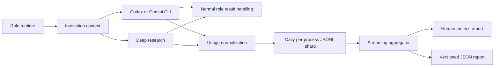

# `teams_runtime` Telemetry Guide

This guide describes the local model telemetry system used to measure model-call cost, latency, retries, and context growth in `teams_runtime`.

## Purpose

`teams_runtime` coordinates several model-backed roles. A single user request, goal, or sprint todo may invoke the orchestrator, research, planner, architect, developer, QA, version controller, parser, and goal sourcer. Contract repair and workflow reopening can add more calls.

Before telemetry, runtime logs showed that a role started and completed, but they did not provide a reliable answer to questions such as:

- which role consumed the most input tokens
- which workflow step dominated latency
- whether session reuse produced meaningful cached-input usage
- how many provider calls were contract repairs or sandbox retries
- which request or sprint caused model-call amplification
- what portion of activity could be assigned a monetary estimate

Telemetry supplies that baseline without changing workflow policy. It is intentionally the first optimization step: later model-tier, prompt-compaction, retry, and batching changes can be evaluated against measured behavior instead of static assumptions.

## Goals And Non-Goals

Goals:

- record one event for every real provider attempt
- correlate calls with runtime, role, request, sprint, todo, backlog item, and workflow step
- capture native token usage when a provider exposes it
- measure prompt size, output size, latency, failures, retries, and repairs
- calculate optional cost estimates from operator-supplied rate cards
- remain local, append-only, inspectable, and safe when partially corrupted
- avoid changing the result or availability of model execution

Non-goals:

- sending telemetry to a hosted collector
- reconciling estimates with a provider invoice or subscription allowance
- storing prompts, responses, tool output, or raw errors
- changing models, reasoning levels, prompts, workflow transitions, or retry budgets
- adding a dashboard, database, automatic retention, or historical backfill

## Data Flow



Normal result handling and telemetry are separate. A telemetry write failure logs a warning but does not fail, retry, or modify the role result.

## Configuration

Telemetry is configured in `team_runtime.yaml`:

```yaml
telemetry:
  enabled: true
  rate_cards: {}
```

The block is optional. Existing workspaces that do not contain it behave as follows:

- telemetry is enabled
- token and latency metrics are recorded
- monetary estimates are unavailable until a rate card is configured

Role services load this configuration at startup. Restart affected services after changing it.

### Disable Telemetry

```yaml
telemetry:
  enabled: false
  rate_cards: {}
```

Disabled telemetry does not create invocation records or perform provider-version discovery. It does not delete records that already exist.

### Token Rate Cards

Rate-card keys use the exact `provider/model` identifier recorded by telemetry:

```yaml
telemetry:
  enabled: true
  rate_cards:
    "codex_cli/gpt-5.5":
      input_per_million_usd: 0.00
      cached_input_per_million_usd: 0.00
      output_per_million_usd: 0.00
```

Required token fields:

- `input_per_million_usd`
- `output_per_million_usd`

Optional token field:

- `cached_input_per_million_usd`, which defaults to the normal input rate

The example deliberately uses placeholder zero values. Supply the rate that matches the deployment's billing arrangement. `teams_runtime` does not fetch or hardcode current provider prices.

### Flat Rate Cards

External operations without native token usage may use a per-invocation estimate:

```yaml
telemetry:
  enabled: true
  rate_cards:
    "gemini_deep_research/default":
      per_invocation_usd: 0.00
```

A flat rate is applied to every attempted invocation, including a failed attempt. This is an explicit accounting assumption made by the operator.

### Validation

Configuration loading rejects:

- a non-Boolean `enabled` value
- a non-mapping `rate_cards` value
- keys without the `provider/model` form
- negative or non-finite rates
- token cards missing input or output rates
- cards that mix token and flat pricing
- empty cards without a pricing method

Invalid telemetry configuration prevents service startup in the same way as other invalid runtime policy.

## Provider Coverage

### Codex CLI

Codex execution uses `--json` together with `--output-last-message`.

The final-message file remains the authoritative role response. JSONL standard output is used only for:

- thread or session identity
- terminal token usage
- final-message recovery when the output file is unavailable

Telemetry normalizes:

- input tokens
- cached-input tokens
- output tokens
- reasoning-output tokens
- total tokens

Unknown events and malformed JSONL lines are ignored. If a terminal usage event is absent, the role result still completes and telemetry records `usage_source=unavailable`.

### Gemini CLI

Gemini continues to use `--output-format json`. Its response and session ID are processed as before. The `stats.models` payload is normalized across every reported model:

| Gemini statistic | Telemetry field |
|---|---|
| `tokens.prompt` | `input_tokens` |
| `tokens.cached` | `cached_input_tokens` |
| `tokens.candidates` | `output_tokens` |
| `tokens.thoughts` | `reasoning_output_tokens` |
| `tokens.total` | `total_tokens` |
| `tools.totalCalls` | `tool_calls` |

The raw statistics object is not persisted.

### Deep Research

The external deep-research library does not expose reliable token usage. Telemetry records:

- attempt status
- elapsed time
- prompt characters
- response characters
- configured app and reasoning mode

Token fields remain null. A flat rate can provide an optional accounting estimate.

A provider result that completed successfully remains a completed invocation even if later artifact writing or research-report validation fails. Those are downstream workflow failures rather than provider failures.

## Invocation Lifecycle

Telemetry uses three correlation levels.

### Operation

An operation is one high-level role action, such as a planner task, intent classification, or research prepass. All provider activity generated by that action shares `operation_id`.

### Logical Call

A logical call groups the primary attempt with retries whose purpose is to produce the same logical result. A research decision and external deep research use different logical calls under one research operation.

### Invocation

An invocation is one real provider attempt. Each invocation has a unique `invocation_id` and one of these attempt kinds:

| Attempt kind | Meaning |
|---|---|
| `primary` | Initial provider attempt for a logical call |
| `sandbox_retry` | Retry after a detected write or sandbox denial |
| `contract_repair` | Follow-up attempt to repair invalid role-result JSON |

Purposes distinguish runtime responsibilities:

| Purpose | Runtime activity |
|---|---|
| `role_task` | Normal public-role execution |
| `research_decision` | Research need and subject classification |
| `deep_research` | External source-backed research |
| `intent_classification` | Internal semantic intake parser |
| `goal_sourcing` | Internal goal milestone sourcing |
| `version_control` | Version-controller commit preparation |
| `sprint_closeout_report` | Planner-authored terminal sprint report |

## Record Schema

Each JSONL line is one schema-versioned object.

| Field | Description |
|---|---|
| `schema_version` | Record contract version, currently `1` |
| `invocation_id` | Unique provider attempt |
| `operation_id` | Enclosing role operation |
| `logical_call_id` | Primary call and related retry group |
| `attempt_index` | One-based order within the logical call |
| `attempt_kind` | Primary, sandbox retry, or contract repair |
| `started_at`, `ended_at` | Runtime-timezone ISO-8601 timestamps |
| `duration_ms` | Monotonic elapsed time |
| `pid` | Writer process identifier |
| `runtime_identity` | Service or local helper identity |
| `role` | Public or internal agent role |
| `purpose` | Normalized invocation purpose |
| `workflow_step` | Governed workflow step when available |
| `request_id` | Associated request or empty string |
| `sprint_id` | Associated sprint or empty string |
| `todo_id` | Associated todo or empty string |
| `backlog_id` | Associated backlog item or empty string |
| `goal_id` | Associated operator goal or empty string |
| `provider` | Provider adapter identifier |
| `model` | Configured model or research app |
| `reasoning` | Configured reasoning mode |
| `cli_version` | Lazily detected provider CLI version |
| `session_mode` | `new`, `resume`, or `not_applicable` |
| `session_id_hash` | Truncated SHA-256 session correlation value |
| `status` | Provider invocation completion status |
| `exit_code` | Subprocess exit code or null |
| `error_category` | Content-free normalized failure class |
| `prompt_chars`, `output_chars` | Text sizes without text content |
| `tool_calls` | Native tool-call count or null |
| `input_tokens` | Native input usage or null |
| `cached_input_tokens` | Native cached-input usage or null |
| `output_tokens` | Native output usage or null |
| `reasoning_output_tokens` | Native reasoning usage or null |
| `total_tokens` | Native or consistently derived total |
| `usage_source` | `native` or `unavailable` |
| `estimated_cost_usd` | Rate-card estimate or null |
| `rate_card` | Applied pricing snapshot or null |

Sanitized example:

```json
{
  "schema_version": 1,
  "invocation_id": "a91c...",
  "operation_id": "b72d...",
  "logical_call_id": "c13e...",
  "attempt_index": 1,
  "attempt_kind": "primary",
  "started_at": "2026-07-18T12:00:00+09:00",
  "ended_at": "2026-07-18T12:00:08+09:00",
  "duration_ms": 8000,
  "pid": 42424,
  "runtime_identity": "planner",
  "role": "planner",
  "purpose": "role_task",
  "workflow_step": "planner_draft",
  "request_id": "request-20260718-001",
  "sprint_id": "2026-Sprint-03",
  "provider": "codex_cli",
  "model": "gpt-5.5",
  "session_mode": "resume",
  "session_id_hash": "4f1e8c35a20e9d22",
  "status": "completed",
  "prompt_chars": 18250,
  "output_chars": 2400,
  "input_tokens": 8200,
  "cached_input_tokens": 6100,
  "output_tokens": 900,
  "total_tokens": 9100,
  "usage_source": "native",
  "estimated_cost_usd": null,
  "rate_card": null
}
```

## Storage

Telemetry is stored under the generated workspace runtime root:

```text
.teams_runtime/
  metrics/
    model_invocations/
      2026-07-18/
        planner.42424.jsonl
        orchestrator.local.parser.42425.jsonl
```

Design properties:

- dates use the runtime timezone
- PID-specific shards avoid normal cross-process write contention
- records are compact, append-only JSON lines
- files are flushed after each provider attempt
- a crash may leave one partial final line
- readers skip malformed lines and report their count
- queries visit only date directories in the requested interval
- no automatic deletion or retention policy is applied
- `init --reset` keeps its existing behavior and does not specially preserve metrics

## Privacy And Security

Telemetry is local to the runtime workspace. It does not transmit records to a collector.

The recorder never stores:

- prompt or response text
- raw stdout or stderr
- raw exception messages
- full session IDs
- workspace paths
- commands or command arguments
- environment variables
- credentials
- Discord message content

Session IDs are hashed only to measure reuse. Error details are reduced to categories such as `cli_not_found`, `nonzero_exit`, `provider_output_invalid`, `provider_incomplete`, and `provider_exception`.

Operational role logs remain separate and may contain more diagnostic context according to their existing behavior.

## Cost Estimation

For token-priced models:

```text
uncached_input = max(input_tokens - cached_input_tokens, 0)

estimated_cost =
    uncached_input * input_rate / 1,000,000
  + cached_input_tokens * cached_input_rate / 1,000,000
  + output_tokens * output_rate / 1,000,000
```

Reasoning-output tokens are reported separately but are not added again because provider output totals may already include them.

For flat-priced operations:

```text
estimated_cost = per_invocation_usd
```

The complete applied rate card is stored with a priced record. Historical estimates therefore remain stable if configuration later changes.

An unpriced report is shown as `unpriced`, not `$0.00`. Pricing coverage is the percentage of matched invocations with an estimate.

These values are accounting estimates. They do not incorporate subscription allowances, credits, rate limits, refunds, or provider invoice adjustments.

## CLI Reference

Basic report:

```bash
python -m teams_runtime metrics --hours 24
```

Request report:

```bash
python -m teams_runtime metrics --request-id request-20260718-001 --hours 72
```

Sprint and role report:

```bash
python -m teams_runtime metrics --sprint-id 2026-Sprint-03 --agent planner --hours 168
```

Machine-readable report:

```bash
python -m teams_runtime metrics --hours 24 --json
```

Options:

| Option | Behavior |
|---|---|
| `--workspace-root PATH` | Select a generated runtime workspace |
| `--hours NUMBER` | Positive lookback duration, default `24` |
| `--request-id ID` | Exact request filter |
| `--sprint-id ID` | Exact sprint filter |
| `--agent ROLE` | Exact public or internal role filter |
| `--json` | Emit stable aggregate JSON |

Filters use AND semantics. A request, sprint, and role supplied together must all match one record.

Human output reports totals followed by grouped rows. The JSON output contains:

- `schema_version`
- `generated_at`
- `filters`
- `totals`
- `tokens`
- `latency_ms`
- `groups`

No matching records returns exit code `0` and an explicit no-data message. Invalid hours return exit code `2`.

Latency percentiles use nearest-rank calculation. Native token coverage and pricing coverage are reported independently.

## Analysis Playbook

Use one representative sprint or at least 24 hours of normal traffic before changing policy.

| Observed concentration | Likely next investigation |
|---|---|
| High input tokens in later workflow stages | Compact request events and prompt context |
| Low cached-input ratio on resumed sessions | Inspect session identity and rollover behavior |
| High contract-repair count | Stabilize role-result prompts and contract validation |
| High invocations per logical call | Inspect sandbox and repair retry causes |
| High invocations per request or todo | Reduce workflow fan-out or review cycles |
| High parser or goal-sourcer cost | Configure independent lower-cost helper models |
| High closeout planner cost | Evaluate deterministic report drafting |
| High deep-research latency | Tighten research gating and timeout policy |
| High latency with low token usage | Inspect tools, Git operations, or provider waiting |
| Low pricing coverage | Add exact rate cards or treat tokens as the cost proxy |

Do not compare only total role cost. Normalize by request count, todo count, and logical-call count so a frequently used inexpensive role is not confused with an inefficient role.

### Measuring Helper Tiers And Workflow Budgets

Group telemetry by `role`, `model`, `reasoning`, and `purpose` before changing helper tiers. Compare equivalent workloads with the public role tiers held constant. The sprint benchmark report's `provenance.runtime_model_map` includes `parser`, `sourcer`, and `version_controller`, and its source configuration hash includes their effective settings even when a legacy workspace inherits them from orchestrator.

For review and reopen controls, compare invocations per completed todo and inspect terminal outcomes alongside cost. A reduced call count is not a successful optimization if blocked todos, repair calls, or QA failures increase. See [`docs/call_amplification_controls.md`](call_amplification_controls.md) for exact counter semantics and the controlled experiment procedure.

### Measuring Prompt Compaction

Use comparable requests with long event histories before and after enabling `prompt_context`. Keep the provider, model, reasoning level, request shape, and workflow path stable. Compare:

- `prompt_chars` and native input tokens per logical call
- cached-input tokens and cached-input ratio
- total input tokens per completed request or todo
- contract-repair and retry counts
- failures, QA outcomes, and p95 latency

The expected result is lower prompt size and input-token usage in later workflow stages without a higher repair, retry, failure, or reopen rate. Session reuse can change cached-input behavior independently, so do not attribute every cached-token change to compaction. Telemetry stores prompt size and usage totals, not prompt content or the selected event list; use the content-free `prompt_context_compacted` runtime log for total/included/omitted counts.

For a controlled rollback comparison, set `prompt_context.enabled: false`, restart the same role services, and repeat the same request shape. The canonical persisted event history is identical in either mode.

## Operational Validation

After restarting role services and completing a model-backed request:

```bash
find teams_generated/.teams_runtime/metrics/model_invocations -type f -name '*.jsonl'
python -m teams_runtime metrics --workspace-root teams_generated --hours 1
```

Confirm:

- the expected role and purpose appear
- invocation count matches actual attempts
- repair or retry counts match logs
- token coverage is nonzero for supported native provider events
- no prompt or response content appears in the JSONL record
- estimated cost remains unpriced until a rate card is configured

To validate disabled mode, set `telemetry.enabled` to `false`, restart the role service, run a new request, and confirm no new JSONL line appears.

## Troubleshooting

### The Report Is Empty

Check the workspace root, time window, service restart, and `telemetry.enabled`. Metrics are stored in the generated workspace, not necessarily the project source directory.

### Token Coverage Is Zero

The provider call completed without a recognized native usage event. Confirm the recorded `provider` and `cli_version`. The runtime preserves the role result and marks usage unavailable rather than inventing zeros.

### Cost Is Unpriced

No exact `provider/model` rate-card key matched, or the provider did not expose the token fields required by the token rate. Inspect the grouped provider and model names in the report.

### Invalid Record Count Is Nonzero

A shard contains a partial line, unsupported schema, invalid timestamp, or malformed JSON. Other records remain usable. A single partial final line can result from abrupt process termination.

### Telemetry Write Warning Appears

Check permissions and available disk space under `.teams_runtime/metrics`. The model result is not failed when recording fails. Warnings are throttled to avoid log flooding.

### Provider Schema Changes

Unknown provider fields are ignored. If native coverage drops after a CLI upgrade, add a parser fixture for the new terminal usage shape while preserving schema version `1` when the normalized record contract remains unchanged.

## Compatibility And Versioning

Telemetry records use an explicit `schema_version`.

Compatibility rules:

- additive fields may be introduced without changing version `1`
- readers ignore unknown fields
- missing nullable fields behave as unavailable
- malformed and unsupported records are skipped and counted
- a breaking field meaning or type requires a new schema version
- aggregate JSON is separately versioned through its `schema_version`
- no records are synthesized for calls made before telemetry deployment

The `CodexRunner.run` tuple return contract remains unchanged. Telemetry context is an optional internal keyword, so existing callers can continue to invoke the runner without telemetry metadata.

## Known Limitations

- no hosted dashboard or exporter
- no automatic retention or compression
- no billing reconciliation
- no distributed trace across separate machines
- no historical backfill
- no native deep-research token usage
- no automatic provider-price updates
- percentile calculation retains matched durations in memory

Daily sharding bounds normal query work, but very large installations may eventually require a database or metrics backend.

## Choosing The Next Optimization

Collect a representative sprint and rank groups by total input tokens, total duration, repair count, and estimated cost. Select the next change from the most concentrated measured driver.

Recommended decision order:

1. Fix unexpectedly high repair or retry rates because they spend tokens without advancing workflow.
2. Compact prompts when later stages repeatedly carry large request histories.
3. Move helper or classification purposes to lower-cost models when they dominate call volume.
4. Reduce workflow fan-out when calls per request are high despite stable contracts.
5. Introduce safe parallelism only when latency is dominated by independent work and Git isolation is available.

Measure the same request or sprint shape after the optimization. Compare cost per completed todo, tokens per logical call, repair rate, p95 latency, and QA outcome rather than comparing raw totals from different workloads.
